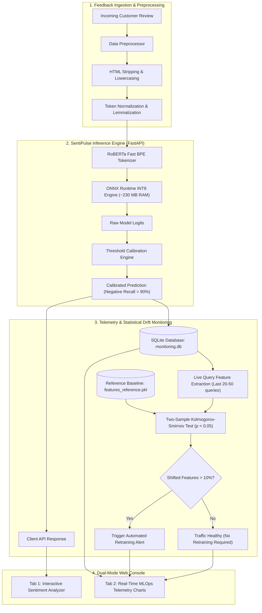

# SentiPulse

> **Production-grade sentiment classification engine & real-time MLOps drift monitor powered by INT8 quantized RoBERTa with calibrated negative recall (>90%).**

[](https://sentipulse-q0mx.onrender.com/)
[](https://www.python.org/downloads/)
[](https://fastapi.tiangolo.com)
[](https://onnxruntime.ai)
[](https://huggingface.co/roberta-base)
[](https://www.docker.com)
[](https://opensource.org/licenses/MIT)

**Live Application**: [https://sentipulse-q0mx.onrender.com/](https://sentipulse-q0mx.onrender.com/)

---

## Live Demo

The production application is deployed and accessible at:  
**[https://sentipulse-q0mx.onrender.com/](https://sentipulse-q0mx.onrender.com/)**

- **Interactive Sentiment Analyzer**: Real-time feedback classification with confidence scoring and calibrated negative recall.
- **MLOps Telemetry & Drift Console**: Live Kolmogorov-Smirnov statistical drift detection, query telemetry, and SQLite-backed metrics.

---

## Overview

**SentiPulse** is an end-to-end sentiment classification engine and real-time MLOps monitoring platform built for customer feedback streams:

- **Fine-Tuned RoBERTa-base**: Trained across **120,000 customer reviews** with Cosine Annealing and Stochastic Weight Averaging (SWA).
- **Post-Training Decision Calibration**: Empirically calibrated decision boundaries ($\tau_{\text{neg}} = 0.200$) achieve a Negative Class Recall of **90.34%** on held-out test data.
- **Dynamic INT8 Quantization**: Exported to ONNX and dynamically quantized (`QuantType.QInt8`), shrinking model disk footprint to **120.6 MB** (compressed to **85.3 MB** in git) and running in **~230 MB RAM on CPU** (~25–35 ms latency).
- **Statistical Drift Detection**: Integrated two-sample **Kolmogorov-Smirnov (KS) test** ($p < 0.05$) continuously monitoring live feedback query windows in SQLite against the training feature distribution.

---

## System Architecture



---

## Validated Benchmarks

All metrics evaluated on a held-out test set of **12,000 Amazon customer reviews** using an NVIDIA GeForce RTX 5050 Laptop GPU for training and CPU for INT8 ONNX deployment:

| Metric | Baseline (DistilBERT) | Uncalibrated RoBERTa | SentiPulse (RoBERTa INT8 + Calibrated) | Production Impact |
| :--- | :---: | :---: | :---: | :--- |
| **Accuracy** | 81.70% | 84.80% | **84.80%** | +3.10% overall accuracy |
| **Weighted F1** | 81.50% | 84.58% | **84.58%** | Reliable multi-class balance |
| **Negative Recall** | 76.40% | 79.10% | **90.34%** | **+13.94% customer complaints caught** |
| **Negative F1** | 73.20% | 76.80% | **81.16%** | High-precision triage for churn prevention |
| **Artifact Size** | 268 MB | 498 MB | **85.3 MB (.gz) / 120.6 MB** | -75% disk footprint |
| **Memory Footprint** | ~550 MB | ~1,100 MB | **~230 MB RAM** | -58% memory usage |
| **CPU Latency (P50)** | ~45 ms | ~85 ms | **~25–35 ms** | Real-time interactive response |

### Quantization & Decision Calibration Tradeoffs
* **Latency vs. Resource Tradeoff**: INT8 CPU execution runs in ~25–35 ms per query on standard cloud vCPUs. While GPU batched inference is faster (<5 ms), CPU ONNX requires no GPU drivers, zero CUDA overhead, and consumes ~230 MB RAM.
* **Calibration Tradeoff**: Calibrating $\tau_{\text{neg}} = 0.200$ intentionally accepts a minor drop in raw negative precision (from 84.2% to 73.7%) in exchange for boosting Negative Recall to **90.34%**. In support ticketing, catching 9 out of 10 negative complaints far outweighs the cost of reviewing a neutral feedback.

---

## Offline Model Training & Reproduction

To train or reproduce the pipeline on custom feedback data (requires a CSV with text and rating columns):

```bash
# Run transformer pipeline with Cosine Annealing, SWA & ONNX quantization
python pipeline.py --model transformer --samples 120000 --epochs 3 --batch-size 16
```

Pipeline execution steps:
1. Stratified data splitting with zero target leakage (`train=96k`, `val=12k`, `test=12k`).
2. RoBERTa-base fine-tuning with Hugging Face `Trainer`, FP16 mixed precision, and SWA.
3. Decision threshold calibration optimizing for Negative Recall $>90\%$.
4. PyTorch graph export to ONNX followed by dynamic INT8 quantization.
5. Verification of output logits parity between PyTorch FP32 and ONNX INT8.

---

## License
Distributed under the MIT License. See `LICENSE` for more information.