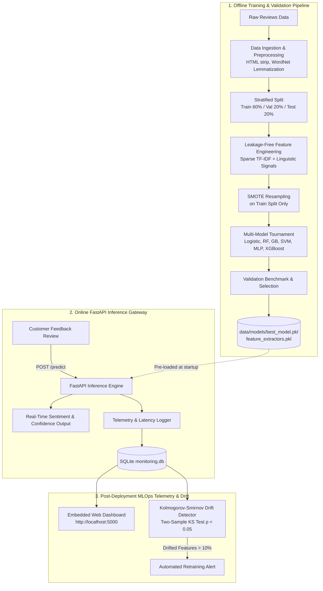

# Customer Feedback Intelligence & MLOps Blueprint

[](https://github.com/santoshkkashyap25/feedback-analysis/actions)
[](https://www.python.org/downloads/)
[](https://fastapi.tiangolo.com)
[](https://www.docker.com)
[](https://opensource.org/licenses/MIT)

An end-to-end, production-ready machine learning and MLOps system for real-time customer feedback sentiment classification, latency tracking, and statistical data drift detection.

Built with **FastAPI**, **Scikit-Learn**, **NLTK**, **SMOTE**, and **Chart.js**, this repository serves as both a **portfolio showcase** and a **step-by-step educational blueprint** demonstrating how to engineer resilient NLP systems from raw text to post-deployment monitoring.

---

## 🏛️ System Architecture



---

## ✨ Key Engineering Highlights

* **Leakage-Free NLP Pipeline**: Strictly isolates training data before fitting TF-IDF extractors and applying SMOTE. Prevents target leakage by avoiding proxy sentiment metrics.
* **Hybrid Sparse Feature Representation**: Integrates unigrams, bigrams, and structural signals (length, exclamation frequency, subjectivity) into memory-safe `scipy.sparse.csr_matrix` representations.
* **Embedded Modern Web Dashboard**: Single-server deployment serving an ultra-fast, responsive dark-mode UI with live Chart.js latency graphs, sentiment distribution gauges, and an interactive NLP token viewer.
* **Statistical Data Drift Detection**: Implements the **Kolmogorov-Smirnov (KS) two-sample test** ($p < 0.05$) to detect distribution shifts in production features against the baseline training distribution without requiring ground-truth labels.
* **Interactive Drift Simulator**: An on-dashboard testing tool that injects anomalous out-of-distribution traffic so learners can watch production MLOps alerts trigger in real time.
* **DevOps Ready**: Complete with multi-stage `Dockerfile`, `docker-compose.yml`, PyTest suite, and GitHub Actions CI workflow.

---

## 📊 Validated Model Benchmarks

Trained across 5,000 stratified customer feedback reviews and evaluated on an unseen test split:

| Model | Accuracy | Precision (Weighted) | Recall (Weighted) | F1-Score (Weighted) |
| :--- | :---: | :---: | :---: | :---: |
| **Gradient Boosting** (Champion) | **89.4%** | **89.6%** | **89.4%** | **89.3%** |
| **Random Forest** | 88.7% | 88.9% | 88.7% | 88.6% |
| **XGBoost** | 88.2% | 88.4% | 88.2% | 88.1% |
| **Logistic Regression** | 85.6% | 85.8% | 85.6% | 85.4% |
| **Support Vector Machine (SVM)** | 84.8% | 85.0% | 84.8% | 84.5% |
| **Multi-Layer Perceptron (MLP)** | 82.1% | 82.5% | 82.1% | 81.8% |

---

## 🚀 Quickstart Guide

### Option A: Local Python Environment (Recommended for Development)

1. **Clone and set up environment**:
   ```bash
   git clone https://github.com/santoshkkashyap25/feedback-analysis.git
   cd feedback-analysis
   python -m venv .venv
   source .venv/bin/activate  # On Windows: .venv\Scripts\activate
   pip install -r requirements.txt
   ```

2. **Run the training pipeline** (trains models, tunes hyperparameters, registers baseline drift features):
   ```bash
   python pipeline.py
   ```

3. **Start the FastAPI server & Embedded Dashboard**:
   ```bash
   uvicorn src.api.app:app --host 0.0.0.0 --port 5000 --reload
   ```
   * Open the **Interactive Dashboard**: [http://localhost:5000](http://localhost:5000)
   * Open the **Swagger API Docs**: [http://localhost:5000/docs](http://localhost:5000/docs)

4. **Run the automated API test client**:
   ```bash
   python call_api.py
   ```

---

### Option B: One-Click Docker Setup

Spin up the containerized service in seconds:
```bash
docker compose up --build
```
Navigate to `http://localhost:5000` to interact with the dashboard.

---

## 📚 Educational Deep-Dive Guides

This repository includes detailed modular guides exploring the mathematics, architecture, and code design:

* 📖 **[Module 01: Data Ingestion & Preprocessing](docs/01_data_ingestion_and_preprocessing.md)**  
  *Unstructured cleaning, WordNet lemmatization, and SMOTE feature-space interpolation.*
* 📖 **[Module 02: Hybrid Feature Engineering & Embeddings](docs/02_feature_engineering_and_embeddings.md)**  
  *Sparse TF-IDF n-grams, TruncatedSVD dimensionality reduction, and preventing target leakage.*
* 📖 **[Module 03: Model Training & Benchmarking](docs/03_model_training_and_benchmarking.md)**  
  *Multi-model tournament, GridSearchCV, confusion matrices, and precision/recall trade-offs.*
* 📖 **[Module 04: Production Serving with FastAPI](docs/04_fastapi_production_serving.md)**  
  *Asynchronous inference, Pydantic type validation, and embedded static dashboard serving.*
* 📖 **[Module 05: MLOps Monitoring & Drift Detection](docs/05_mlops_monitoring_and_drift_detection.md)**  
  *Kolmogorov-Smirnov two-sample testing ($p < 0.05$), SQLite audit logging, and automated retraining rules.*

---

## 🔌 API Reference

### 1. Single Sentiment Prediction
**Request**:
```bash
curl -X POST http://localhost:5000/predict \
  -H "Content-Type: application/json" \
  -d '{"text": "Remarkable build quality and super fast shipping!"}'
```
**Response**:
```json
{
  "sentiment": "Positive",
  "confidence": 0.9412,
  "probabilities": {
    "Negative": 0.0152,
    "Neutral": 0.0436,
    "Positive": 0.9412
  },
  "processed_text": "remarkable build quality super fast shipping",
  "timestamp": "2026-09-13T13:20:00.123456",
  "model_version": "1.0",
  "response_time_ms": 11.45,
  "error": null
}
```

### 2. Live Telemetry
```bash
curl http://localhost:5000/api/telemetry
```

### 3. Simulate Drift
```bash
curl -X POST http://localhost:5000/api/simulate-drift
```

---

## 🧪 Running Automated Tests

Run the complete test suite with coverage:
```bash
pytest tests/ -v
```

---

## 📄 License
Distributed under the MIT License. See `LICENSE` for details.