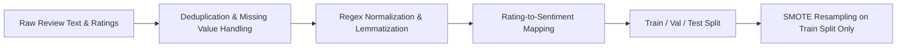
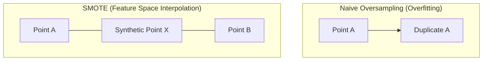

# Module 01: Data Ingestion & Preprocessing

An educational deep dive into ingesting raw customer feedback, cleaning unstructured text, handling severe class imbalance, and preventing data leakage.

---

## 1. The Challenge of Raw Customer Feedback

Raw customer feedback (such as e-commerce product reviews, support tickets, or app store feedback) is unstructured, messy, and imbalanced:
- **HTML tags & markup**: Injected from web scrapers or rich text inputs.
- **Punctuation & Case Variation**: *"AMAZINGGG!!!"* vs *"great"*.
- **Class Imbalance**: Customers are far more likely to leave 5-star ratings or 1-star complaints than neutral 3-star reviews.
- **Data Leakage Risks**: Performing text cleaning, vectorization, or class balancing across the whole dataset before splitting leaks test set information into training.



---

## 2. Text Normalization Pipeline

Our [`DataPreprocessor`](file:///d:/Projects/feedback-analysis/src/data/preprocessing.py) executes the following sequence:

### Step A: Regex Cleaning
1. Strip HTML tags: `re.sub(r'<[^>]+>', '', text)`
2. Strip non-alphabetic characters: `re.sub(r'[^a-zA-Z\s]', '', text)`
3. Compress extra whitespace: `re.sub(r'\s+', ' ', text).strip()`
4. Lowercase conversion for case-insensitive matching.

### Step B: Tokenization & Lemmatization
Instead of **stemming** (which crudely truncates words, e.g. *"running"* $\to$ *"run"*, *"better"* $\to$ *"better"*), we use **WordNet Lemmatization**:
- Maps words to their authentic dictionary lemma using morphological analysis (e.g. *"ran"*, *"running"* $\to$ *"run"*).
- Eliminates non-informative English stopwords (e.g., *"the"*, *"is"*, *"at"*).

```python
from nltk.stem import WordNetLemmatizer
from nltk.corpus import stopwords
from nltk.tokenize import word_tokenize

lemmatizer = WordNetLemmatizer()
stop_words = set(stopwords.words('english'))

tokens = word_tokenize(clean_text)
clean_tokens = [lemmatizer.lemmatize(w) for w in tokens if w not in stop_words]
```

---

## 3. Sentiment Label Mapping

Review stars (1 to 5) are categorized into three discrete sentiment classes:
- **1 – 2 Stars** $\to$ `Negative` (Class 0)
- **3 Stars** $\to$ `Neutral` (Class 1)
- **4 – 5 Stars** $\to$ `Positive` (Class 2)

---

## 4. Handling Class Imbalance with SMOTE

Real-world review datasets typically have a 70% positive, 20% negative, and 10% neutral split. Models trained on this raw distribution suffer from **majority class bias**—they default to predicting positive and fail on negative or neutral samples.

### How SMOTE Works (Synthetic Minority Over-sampling Technique)
Rather than simply duplicating existing minority records (which causes decision trees to overfit to duplicate points), SMOTE synthesizes *new* points in feature space:
1. For each minority sample $\vec{x}_i$, find its $k$-nearest neighbors in the minority class.
2. Select one random neighbor $\vec{x}_{zi}$.
3. Generate a synthetic sample along the line segment joining them:
$$\vec{x}_{\text{new}} = \vec{x}_i + \lambda (\vec{x}_{zi} - \vec{x}_i) \quad \text{where } \lambda \sim U(0, 1)$$



> [!IMPORTANT]
> **Data Leakage Golden Rule**: SMOTE must **NEVER** be applied before splitting into train and test sets! If SMOTE generates synthetic points before the split, synthetic points derived from test set neighbors leak into the training partition, producing artificially inflated metrics. Always split first, then apply SMOTE only to `(X_train, y_train)`.

---

## 5. Standalone Execution & Exploration

You can run and test preprocessing directly from Python:

```python
from src.data.preprocessing import DataPreprocessor

preprocessor = DataPreprocessor({})
sample = "<p>The package arrived on time! However, customer support was HORRIBLE.</p>"
clean = preprocessor.clean_text(sample)

print("Original:", sample)
print("Cleaned:", clean)
# Output: package arrived time however customer support horrible
```
