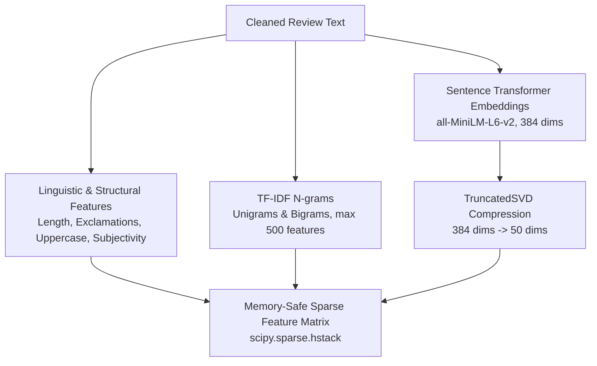

# Module 02: Hybrid Feature Engineering & Embeddings

A comprehensive guide to extracting linguistic, statistical, and semantic representations from text while maintaining memory efficiency and avoiding data leakage.

---

## 1. Feature Representation Strategy

In modern NLP, single feature types have distinct trade-offs:
- **TF-IDF**: Excellent at capturing specific keywords (*"defective"*, *"pristine"*), but blind to word order and semantic synonyms (*"terrific"* vs *"stellar"*).
- **Sentence Embeddings (Transformers)**: Superior semantic understanding, but computationally heavy and dense.
- **Statistical / Linguistic Signals**: Word counts, exclamation frequency, and subjectivity capture emotional intensity.

Our [`FeatureEngineer`](file:///d:/Projects/feedback-analysis/src/features/feature_engineering.py) integrates all three into a unified sparse feature representation:



---

## 2. Component Deep Dive

### A. Linguistic & Structural Signals
Feedback intensity is often indicated by structure rather than vocabulary alone:
* **Length & Word Count**: Extremely short reviews (*"bad"*) vs detailed explanations.
* **Exclamation & Question Marks**: Frustration (*"Where is my package???"*) or excitement (*"Loved it!"*).
* **Uppercase Count**: Shouting (*"DO NOT BUY"*).
* **TextBlob Subjectivity**: Quantifies factual statements ($0.0$) vs opinionated personal sentiment ($1.0$).

> [!CAUTION]
> **Data Leakage Case Study**: In early iterations of this codebase, `TextBlob(...).sentiment.polarity` was included as a feature. Because polarity scores directly measure positive/negative words, decision trees used polarity as a cheat code, resulting in **100% artificial accuracy**. Removing polarity forces models to learn authentic vocabulary associations from scratch.

### B. TF-IDF (Term Frequency - Inverse Document Frequency)
TF-IDF balances term importance within a document against its frequency across the entire corpus:
$$\text{TF-IDF}(t, d, D) = \text{TF}(t, d) \times \log\left(\frac{1 + |D|}{1 + |\{d \in D : t \in d\}|}\right) + 1$$
We extract unigrams and bigrams (`ngram_range=(1, 2)`) to capture phrases like *"not good"* or *"great service"*.

### C. Sentence Transformers & TruncatedSVD
When deep semantic embeddings are enabled:
1. Reviews are encoded with `all-MiniLM-L6-v2` (producing 384-dimensional dense vectors).
2. Because dense matrices require substantial RAM, we apply **Truncated Singular Value Decomposition (TruncatedSVD)** to reduce the vector space from 384 dimensions to 50 principal components while preserving maximum variance.

---

## 3. Memory Safety: Sparse Matrix Concatenation

Dense floating-point matrices for thousands of rows quickly exhaust RAM:
- 5,000 samples $\times$ 500 features $\times$ 8 bytes (Float64 dense) $\approx$ High memory footprint.
- In sparse matrices, $95\%$ of entries are zeroes and consume zero storage.

We construct the final feature space using `scipy.sparse.hstack`:
```python
from scipy.sparse import hstack, csr_matrix

basic_sparse = csr_matrix(basic_features.values.astype(np.float32))
combined = hstack([basic_sparse, tfidf_features]).tocsr()
```

---

## 4. How to Test Feature Extraction Locally

Run this snippet in your terminal to inspect the generated feature dimensions:

```python
import pandas as pd
from src.features.feature_engineering import FeatureEngineer

df = pd.DataFrame({
    'reviewText_clean': [
        "fast shipping and great quality",
        "broken item terrible customer support",
        "average product nothing special"
    ]
})

engineer = FeatureEngineer({})
X, _ = engineer.engineer_features(df, 'reviewText_clean', is_training=True)

print("Feature Matrix Shape:", X.shape)
print("Non-zero entries (density):", X.nnz)
```
