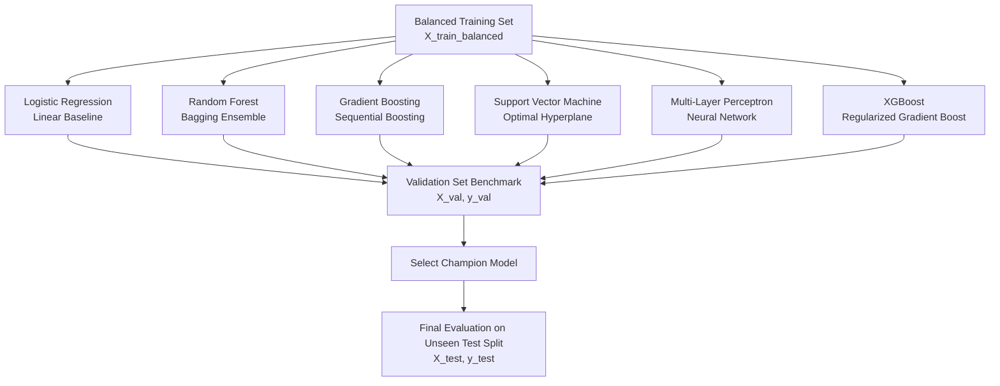

# Module 03: Model Training & Benchmarking

An architectural comparison of 6 machine learning classifiers for text sentiment analysis, hyperparameter optimization, and evaluation metrics.

---

## 1. Multi-Model Tournament Architecture

Rather than assuming one model fits all NLP problems, our [`ModelTrainer`](file:///d:/Projects/feedback-analysis/src/models/training.py) trains and benchmarks six distinct model families:



### Candidate Classifiers Comparison

| Model | Primary Advantage | Typical Challenge |
| :--- | :--- | :--- |
| **Logistic Regression** | Ultra-fast inference, highly interpretable coefficients | Linear boundary assumption |
| **Random Forest** | Robust against noise, handles high-dimensional sparse inputs | Slower tree ensemble inference |
| **Gradient Boosting** | High accuracy via error correction | Susceptible to overfitting if unregularized |
| **SVM (Linear / RBF)** | Effective in high-dimensional text vector spaces | Slow training time on large corpora ($O(n^2)$) |
| **MLP (Neural Net)** | Learns non-linear feature interactions | Demands more tuning and data volume |
| **XGBoost** | Best-in-class performance with shrinkage & tree regularization | Requires hyperparameter calibration |

---

## 2. Hyperparameter Tuning via GridSearchCV

We tune critical hyperparameters for each model family:
* **Logistic Regression**: Regularization strength $C \in \{0.1, 1, 10\}$.
* **Random Forest**: Estimators $n \in \{100, 200\}$, maximum depth $\{10, 20, \text{None}\}$.
* **XGBoost / Gradient Boosting**: Learning rate $\eta \in \{0.1, 0.2\}$, max depth $\{3, 5, 6\}$.

---

## 3. Evaluation Metrics: Beyond Raw Accuracy

In 3-class sentiment classification, raw accuracy can be misleading if classes are imbalanced:

* **Precision**: Measures false positive rates. When the model predicts *Positive*, how often is it truly positive?
$$\text{Precision} = \frac{\text{TP}}{\text{TP} + \text{FP}}$$
* **Recall (Sensitivity)**: Measures false negative rates. Out of all actual *Negative* complaints, how many did the system catch?
$$\text{Recall} = \frac{\text{TP}}{\text{TP} + \text{FN}}$$
* **F1-Score**: The harmonic mean of precision and recall:
$$F_1 = 2 \times \frac{\text{Precision} \times \text{Recall}}{\text{Precision} + \text{Recall}}$$

### Confusion Matrix Interpretation
Our [`ModelEvaluator`](file:///d:/Projects/feedback-analysis/src/models/evaluation.py) outputs confusion matrices:
* **Row**: True class (`Negative`, `Neutral`, `Positive`)
* **Column**: Predicted class
* Off-diagonal values reveal systematic confusion (e.g. *Neutral* classified as *Positive*).

---

## 4. Running the Complete Training Pipeline

Execute the full training pipeline from the terminal:

```bash
python pipeline.py
```

Expected workflow:
1. Validates and loads raw reviews from `data/raw/`.
2. Cleans and lemmatizes text into `data/processed/processed_reviews.csv`.
3. Partitions data into 60% Train, 20% Validation, 20% Test.
4. Fits TF-IDF extractors on Train split, transforms Val and Test splits.
5. Balances training split using SMOTE.
6. Trains all 6 candidate models and prints validation scores.
7. Saves the champion model to `data/models/best_model.pkl`.
8. Generates final test metrics and registers baseline features for drift detection.
