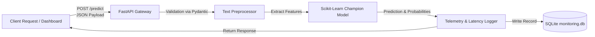

# Module 04: Production Serving with FastAPI

How to transform trained model weights into a high-performance, asynchronous REST API with embedded dashboard monitoring.

---

## 1. Why FastAPI for ML Inference?

While Flask is common in introductory tutorials, **FastAPI** is the modern industry standard for ML model serving:
- **Asynchronous Execution (`async`/`await`)**: Non-blocking I/O allows the server to handle concurrent telemetry requests and dashboard polling effortlessly.
- **Pydantic Data Validation**: Guaranteed schema adherence, automatic type conversion, and descriptive error messages.
- **Auto-Generated OpenAPI/Swagger Docs**: Interactive documentation at `/docs` without writing manual YAML specifications.
- **Integrated Static Asset Serving**: Serves the embedded HTML/CSS/JS dashboard directly without needing a separate Node.js or Nginx frontend container.



---

## 2. Architecture & Key Patterns in `app.py`

### A. Pre-Loading Model Artifacts at Startup
Models should never be re-read from disk on every HTTP request! In [`src/api/app.py`](file:///d:/Projects/feedback-analysis/src/api/app.py), artifacts are loaded once into memory when the server boots:

```python
class FeedbackAnalysisAPI:
    def __init__(self):
        self.model = None
        self.feature_engineer = None
        self.load_model_and_extractors()
```

### B. Real-Time Telemetry Logging
Every incoming prediction is timed using `time.time()` and asynchronously logged to `monitoring.db`:
```python
@app.post("/predict", response_model=PredictResponse)
async def predict(payload: PredictRequest):
    t0 = time.time()
    result = api.predict_sentiment(payload.text)
    latency_sec = time.time() - t0

    monitor.log_prediction(
        input_text=payload.text[:500],
        prediction=result['prediction_id'],
        confidence=result['confidence'],
        response_time=latency_sec
    )
    result['response_time_ms'] = round(latency_sec * 1000, 2)
    return result
```

### C. Serving the Embedded Web Dashboard
FastAPI mounts the static folder and serves `index.html` at the root URL:
```python
from fastapi.staticfiles import StaticFiles
from fastapi.responses import FileResponse

app.mount("/static", StaticFiles(directory=STATIC_DIR), name="static")

@app.get("/", response_class=FileResponse)
async def serve_dashboard():
    return FileResponse(TEMPLATE_DIR / "index.html")
```

---

## 3. Starting the Server

Launch the production server via Uvicorn:

```bash
uvicorn src.api.app:app --host 0.0.0.0 --port 5000 --reload
```

Once running:
- **Interactive Dashboard**: Open [http://localhost:5000](http://localhost:5000) in your browser.
- **Interactive Swagger Docs**: Open [http://localhost:5000/docs](http://localhost:5000/docs).
- **Alternative ReDoc**: Open [http://localhost:5000/redoc](http://localhost:5000/redoc).

---

## 4. Testing Endpoints via Terminal

### Single Sentiment Prediction (cURL)
```bash
curl -X POST http://localhost:5000/predict \
  -H "Content-Type: application/json" \
  -d '{"text": "Remarkable build quality and super fast shipping!"}'
```

Response:
```json
{
  "sentiment": "Positive",
  "confidence": 0.9412,
  "probabilities": {
    "Negative": 0.0152,
    "Neutral": 0.0436,
    "Positive": 0.9412
  },
  "timestamp": "2026-09-13T13:20:00.123456",
  "model_version": "1.0",
  "processed_text": "remarkable build quality super fast shipping",
  "response_time_ms": 11.45,
  "error": null
}
```

### Python Client Script
Run the automated test client to verify health, inference, telemetry, and drift simulation:
```bash
python call_api.py
```
