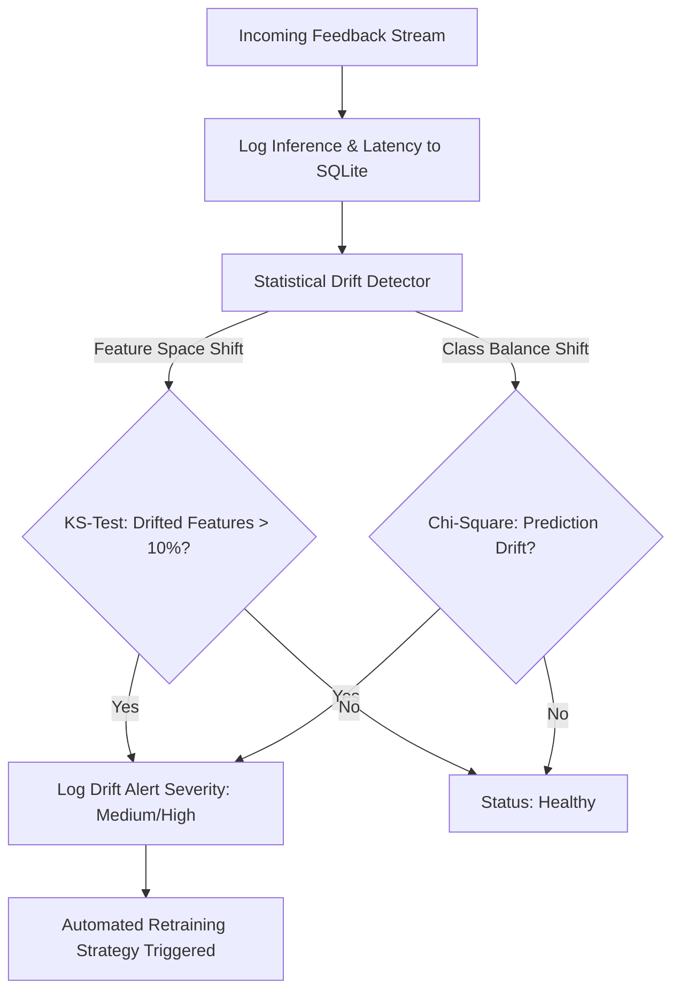

# Module 05: MLOps Monitoring & Statistical Drift Detection

Understanding model degradation in production, the mathematics of the Kolmogorov-Smirnov test, and automated retraining triggers.

---

## 1. Why ML Models Fail in Production

Deploying an ML model is not the end of the engineering lifecycle—it is the beginning. Real-world feedback changes constantly:
* **Covariate Shift (Data Drift)**: The distribution of inputs $P(X)$ changes while $P(Y|X)$ remains constant (e.g. users begin typing feedback in shorthand slang or automated diagnostic logs are accidentally ingested).
* **Concept Drift**: The relationship between input features and target sentiment $P(Y|X)$ changes (e.g., the word *"sick"* shifts from negative to positive slang).
* **Latency & Infrastructure Degradation**: Unchecked request volume degrades P95 response times.



---

## 2. The Kolmogorov-Smirnov (KS) Two-Sample Test

To detect feature drift without needing ground-truth customer labels, we use the non-parametric **two-sample Kolmogorov-Smirnov test** in [`src/monitoring/drift_detection.py`](file:///d:/Projects/feedback-analysis/src/monitoring/drift_detection.py).

### Mathematical Intuition
Given:
- Sample $1$: Baseline training feature distribution $F_1(x)$ (saved at `data/processed/features_reference.pkl`).
- Sample $2$: Live production inference feature distribution $F_2(x)$.

The KS statistic $D$ quantifies the maximum vertical distance between their **Empirical Cumulative Distribution Functions (ECDFs)**:
$$D = \sup_x |F_1(x) - F_2(x)|$$

```
   1.0 |                   .--- F1(x) [Baseline]
       |                 .' |
  ECDF |               .'   |  <-- Max Distance D
       |             .'     |
       |      .----'        .--- F2(x) [Live Production]
   0.0 +---------------------------------
                     Feature Value x
```

### Statistical Significance (p-value)
Under the null hypothesis $H_0$, both samples are drawn from the same underlying distribution:
- If **$p < 0.05$**, we reject $H_0$: the feature has statistically drifted.
- If **$>10\%$ of all monitored features** exhibit $p < 0.05$, an overall **Data Drift Alert** is raised.

```python
from scipy.stats import ks_2samp

ks_stat, p_value = ks_2samp(ref_feature, current_feature)
drift_detected = p_value < 0.05
```

---

## 3. Prediction Drift via Chi-Square Contingency Test

When ground-truth labels are delayed, tracking the distribution of predicted labels (Negative, Neutral, Positive) flags anomalous changes:
$$\chi^2 = \sum \frac{(O_i - E_i)^2}{E_i}$$
If the expected sentiment proportion deviates significantly from the baseline distribution ($p < 0.05$), a **Prediction Drift Alert** is logged.

---

## 4. Retraining Strategy Triggers

In [`src/monitoring/drift_detection.py`](file:///d:/Projects/feedback-analysis/src/monitoring/drift_detection.py), the `RetrainingStrategy` evaluates whether the model requires retraining based on four distinct rules:

1. **Drift Alert Accumulation**: More than 5 drift alerts recorded.
2. **Performance Degradation**: Validation or logged test accuracy drops by more than $5\%$.
3. **Data Volume Accumulation**: Over 10,000 new feedback records ingested since last training.
4. **Time-based Cadence**: Exceeding the 30-day scheduled retraining horizon.

---

## 5. Interactive Testing via the Dashboard

You can watch statistical drift detection fire live without waiting for production traffic:
1. Open the dashboard at [http://localhost:5000](http://localhost:5000).
2. Scroll to the **Kolmogorov-Smirnov Drift Monitor** section.
3. Click **"Simulate Production Data Drift"**.
4. The system injects out-of-distribution synthetic system crash telemetry, extracts TF-IDF vectors, runs the KS test against the baseline, and displays the exact percentage of drifted features and the logged alert.
